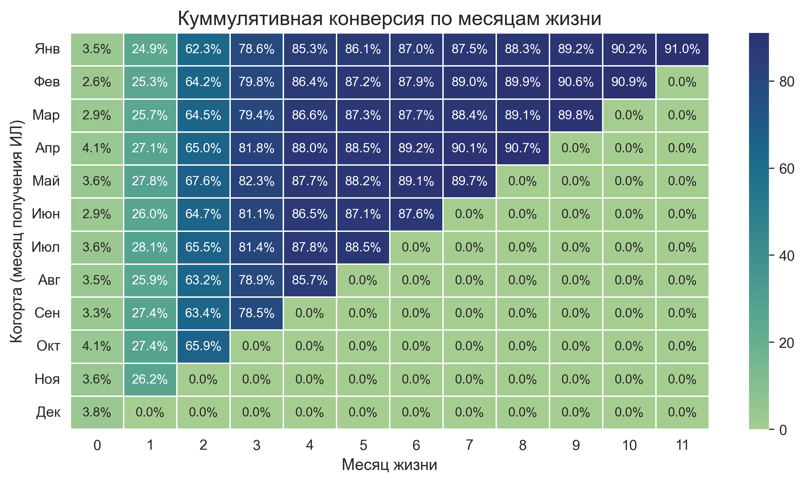

# Анализ эффективности процесса взыскания - когортный анализ конверсии из исполнительного листа в возбуждение исполнительного производства

## Главная цель данного анализа - оценить и визуализировать операционную эффективность процесса взыскания, проанализировав временной лаг между получением юридического основания для взыскания (исполнительного листа) и фактическим началом работы приставов (возбуждением ИП - исполнительного производства).

Мы сможем ответить на вопрос: 'Насколько быстро и успешно исполнительный лист (ИЛ) превращается в работающий механизм взыскания?'

В анализе используются две ключевые метрики:
- Конверсия в ВИП (возбуждение исполнительного производства)
- Время до ВИП

Для анализа мы будем использовать понятие 'месяц жизни' когорты, где месяц 0 - это месяц получения исполнительного листа, месяц 1 - следующий за ним календарный месяц, и так далее.

## Используемые технологии и библиотеки

В этом проекте были использованы следующие инструменты:

## Источник данных

В связи с соглашением о неразглашении (NDA), оригинальные данные компании не могли быть использованы в этом публичном проекте.
Поэтому для демонстрации анализа был сгенерирован синтетический набор данных с помощью скрипта `generate_data.py`. 

Особенности сгенерированных данных:
* Заложена общая вероятность успешного возбуждения исполнительного производства (ВИП) на уровне 92%.
* Для имитации 'закрытия года' активность в 4-м квартале 2024 года увеличена на 20%. Это приводит к росту числа полученных исполнительных листов в конце года.
* Добавлена механика 'длинного хвоста' - 6% успешных дел получают значительно большую задержку (от 5 до 12 месяцев) до ВИП. Остальные дела конвертируются быстрее, в основном за 1-4 месяца.
* Даты всех сопутствующих событий (подача иска, судебное решение и т.д.) генерируются с логически верными временными задержками относительно даты получения исполнительного листа.

Скрипт генерирует файл `/data/activities.csv` - отчет по мероприятиям по судебным делам.

## Ключевые выводы

#### Кумулятивная конверсия по месяцам жизни когорты

*   **Итоговая конверсия составляет 90-91%**, что говорит о высокой эффективности процесса.
*   **Медианное время до ВИП - 53 дня.** Основная масса дел конвертируется в течение 1-2 месяцев после получения ИЛ.
*   **Процесс стабилен в течение года.** Даже пиковые нагрузки в 4 квартале не приводят к замедлению работы.
*   **Существует 'длинный хвост'.** Есть небольшая доля дел (~4-5%), конверсия по которым затягивается на 4+ месяцев.

## Дальнейшие шаги

* Проанализировать 'потери' (~9%): выяснить основные причины, по которым не возбуждается ВИП (возврат, добровольная оплата и т.д.), чтобы повысить итоговую конверсию.
* Оптимизировать 'длинный хвост': изучить дела со сроком >120 дней для выявления узких мест и сокращения среднего времени до конверсии.

## Структура
* `/data_generation/` - содержит Python-скрипт, который генерирует набор данных.
* `/data/` - содержит сгенерированный файл данных, используемый в анализе.
* `/notebooks/` - содержит Jupyter-ноутбук с полным пошаговым анализом.
* `/images/` - содержит все графики, использованные в анализе

